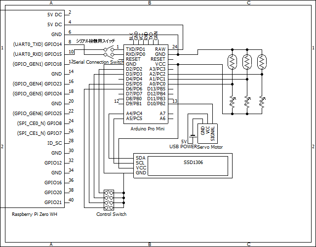

# Handsfree Box
3年工作実習で作成したプログラム
非接触で操作ができる簡易電子錠付き宅配ボックス

## 開発環境
### ハードウェア
- Arduino Pro Mini
- Raspberry Pi Zero WH
- Micro Servo SG92R
- HiLetgo 0.91" SSD1306 OLED Display

### Webアプリ
- Node.js v15.5.1
- TypeScript
- Next.js 10.0.5
- React 17.0.1
- Sass
- firebase SDK 8.2.2
- material-ui

## 回路図

## 著作権表記
Copyright (c) 2020-2021 Junki Tomatsu